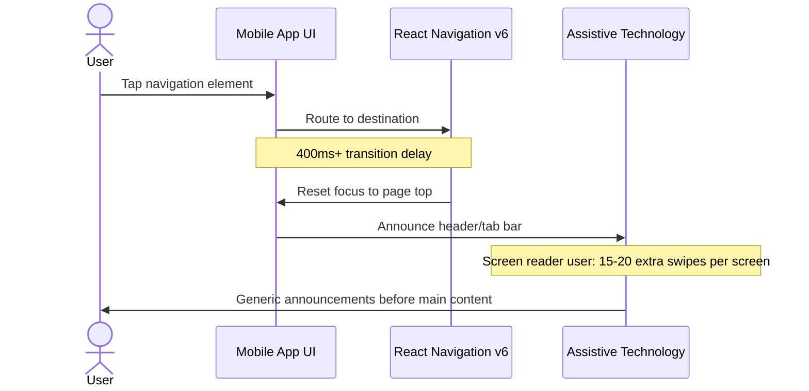
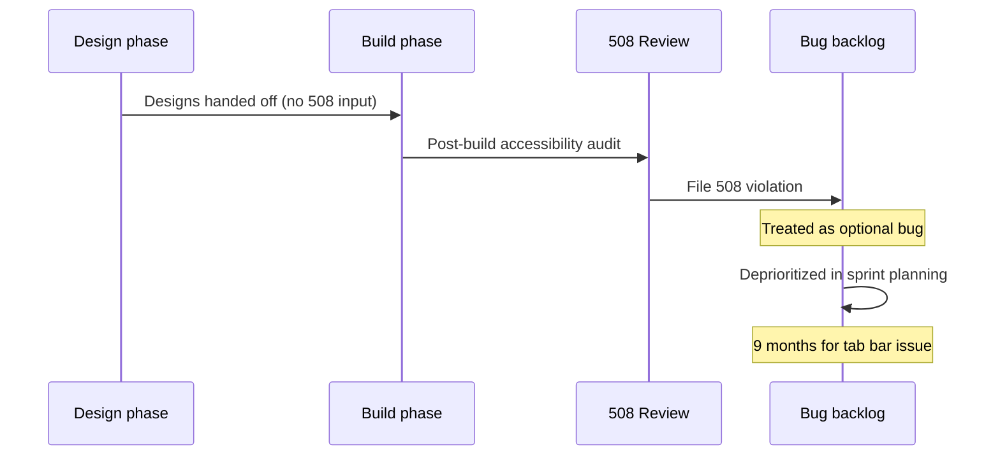

# Stakeholder Synthesis: VA Mobile App Navigation

**Study:** va-mobile-nav-2026 &nbsp; | &nbsp; **Researcher:** Lapedra Tolson &nbsp; | &nbsp; **Date:** May 1, 2026 &nbsp; | &nbsp; **Status:** Draft

---

## Summary

Three internal stakeholders — Product, Engineering, and Accessibility — were interviewed about constraints and priorities for the VA Health & Benefits mobile app navigation. Stakeholders converge on navigation as the highest-impact problem but diverge on whether accessibility belongs in the critical path. The most consequential gap: accessibility is stated as P1 but routinely deprioritized in sprint planning, creating legal exposure and excluding 12% of users from core tasks.

| | |
|---|---|
| **Stakeholders interviewed** | 3 |
| **Teams represented** | OCTO Mobile Experience, OCTO Mobile Engineering, VA Section 508 Office |
| **Interview duration** | 36 minutes each |
| **Key tension** | Accessibility — stated priority vs. sprint behavior |

> [!IMPORTANT]
> **Most actionable insight:** Stakeholders agree navigation is broken, but disagree on root cause — Product frames it as IA, Engineering as performance, Accessibility as focus management. User research must answer which is the user-facing experience, since the technical fix differs significantly by diagnosis.

---

## Stakeholders interviewed

| ID | Role | Team | Focus area |
|----|------|------|------------|
| SH-001 | Product Owner | OCTO Mobile Experience | Product priorities, stakeholder alignment |
| SH-002 | Engineering Lead | OCTO Mobile Engineering | Technical architecture, performance |
| SH-003 | Accessibility Specialist | VA Section 508 Office | WCAG compliance, AT support |

---

## 01 &nbsp;&nbsp; Constraints

> "We can't just do our own thing — the design system team has to sign off, and that adds 2-3 weeks to any significant UI change."
> — SH-001

| Type | Constraint | Impact | Source |
|------|------------|--------|--------|
| Technical | React Navigation v6 with 4-level nested navigators | 400ms+ transitions, broken deep linking, inconsistent back button | SH-002 |
| Technical | Limited device testing (iPhone 14+, Pixel 6+ only) | Performance issues uncatchable on devices older Veterans use | SH-002 |
| Technical | 4 mobile engineers shared across entire app | 6-8 sprints for complete navigation overhaul | SH-002 |
| Policy | Section 508 / WCAG 2.2 AA mandatory | 14 open violations, 3 navigation-related | SH-001, SH-003 |
| Policy | ATO renewal Q4 2026 | Architecture must stabilize before review | SH-001 |
| Policy | VA design system component library restrictions | 2-3 weeks approval; 6 weeks for custom components | SH-001, SH-002 |
| Resource | Shared QA team across 5 products | 2 weeks of QA per 6-week cycle | SH-001 |
| Resource | 3 Section 508 specialists across all VA digital products | Reviews happen post-build | SH-003 |
| Resource | Tech debt at 30% (target 15%) | Engineering pushback on new features | SH-002 |

**Confidence** — Strong (multiple stakeholders independently surfaced constraints; technical claims verifiable against codebase)

---

## 02 &nbsp;&nbsp; Strategic priorities and alignment

| Priority | Stated by | Aligns with user need? | Notes |
|----------|-----------|:---:|-------|
| Navigation overhaul | SH-001 | ✓ | Driver: app store ratings, congressional inquiries |
| Appointment self-scheduling expansion | SH-001 | ✓ | Driver: user demand |
| Secure messaging latency reduction | SH-001 | ✓ | Driver: performance |
| React Navigation v6 → v7 upgrade | SH-002 | ⚠ | User-facing benefit unclear |
| Accessibility remediation | SH-003 | ✓ | Stated P1, sprint-deprioritized |

> [!WARNING]
> **Alignment gap — Accessibility:** All stakeholders rate accessibility as P1, but SH-001 acknowledged: "We say it's P1 but when push comes to shove and we're behind on a sprint, accessibility fixes get bumped." This pattern excludes 12% of users from core tasks and creates ATO renewal exposure.

**Confidence** — Strong (the gap was directly stated by the Product Owner; behavior pattern documented in 9-month-old open issue)

---

## 03 &nbsp;&nbsp; System dynamics

> Two flows where stakeholder input revealed invisible failure modes. Detailed system observations from all interviews are preserved in the Appendix as raw input for service blueprint synthesis.

### Navigation flow with assistive technology

> "Focus should land on the main content. Instead it goes to the top of the page, which means screen reader users have to re-navigate past the header and tab bar on every single screen change."
> — SH-003

**Where it breaks** — Focus management resets per transition; AT users absorb the cumulative cost of every navigation event.

**Confidence** — Strong (technical mechanism described by SH-002 and SH-003 independently; user impact estimable from session count × screens per session)

---

### Accessibility review process

> "I review designs after they're built, which is too late for structural changes. By the time I see navigation patterns, the code is written and my feedback becomes 'too expensive to fix.'"
> — SH-003

**Where it breaks** — Accessibility review happens AFTER architectural decisions are locked; structural fixes are reframed as "too expensive."

**Confidence** — Moderate (process described by SH-003; SH-001 acknowledged the pattern but offered no countervailing evidence)

---

## 04 &nbsp;&nbsp; Stakeholders believe / Reality / Opportunity

| Stakeholders believe | Reality from research and data | Opportunity |
|---|---|---|
| IA is built around veteran tasks | IA is organized by VA departments (Health vs. Benefits vs. Payments); 2024 card sort showed veterans group by task | Test task-based IA — could be 3-sprint reorganization vs. 8-sprint paradigm change |
| The app works the same for everyone | 12% of users (AT) have fundamentally different experience; aggregate metrics hide their lower task completion | Segment success metrics by AT usage to surface the gap |
| Accessibility issues are technical edge cases | Accessibility gaps stem from process (post-build review, sprint deprioritization), not technology | Frame accessibility research as mainstream usability, not special accommodation |
| Slow interactions are quality issues | Engineering knows specific technical causes (React Nav v6, nested stacks); leadership sees only user-facing metrics | Connect user frustration to specific technical debt — informs investment case |
| User feedback reaches the team | No formal channel for navigation feedback; stakeholder assumptions drive priorities | This research is the first systematic user input on navigation — findings will have outsized influence |

**Confidence** — Mixed. "IA mismatch" is Strong (data + stakeholder alignment). "Accessibility as process problem" is Strong (SH-003 + SH-001 confirm). "User feedback channel" is Moderate (one stakeholder source).

---

## 05 &nbsp;&nbsp; Questions for user research

### Blocking — must answer before design decisions

| Stakeholder insight | Research question | Suggested method |
|---|---|---|
| SH-001: IA may be built on wrong mental model | How do veterans mentally categorize VA services when completing tasks? | Card sort + tree test of current vs. task-based IA |
| SH-002: IA reorganization vs. new paradigm are different cost classes | Which navigation problems can be solved by reorganization vs. requiring new patterns? | Comparative usability across three conditions |
| SH-003: AT and non-AT users may have different needs | Are navigation pain points universal or AT-specific? | Parallel sessions, identical tasks, AT and non-AT |

### Important — informs but doesn't block

| Stakeholder insight | Research question | Suggested method |
|---|---|---|
| SH-001: Prescription refill works; nothing else does | What makes prescription refill successful and how is that preserved? | Task analysis — success patterns vs. broken flows |
| SH-002: Older devices compound performance issues | How do navigation issues affect task completion on older devices? | Usability on iPhone SE / Pixel 4a |
| SH-003: Late-life AT users may navigate differently | Do navigation preferences vary by AT experience timeline? | Interviews across AT experience spectrum |

### Validation — test stakeholder assumptions with users

- "If veterans can't find features, it doesn't matter how good the features are" (SH-001) → measure relationship between navigation success and feature adoption
- "Users tap, wait, tap again, end up two screens deep" (SH-002) → observe tap behavior during slow transitions
- 55% task completion is acceptable baseline (all stakeholders) → validate whether 55% reflects success or workaround behavior

---

## 06 &nbsp;&nbsp; Open questions

Questions stakeholders couldn't answer — flag for follow-up.

| Question | Who might know | Why it matters |
|----------|----------------|----------------|
| Do veterans think Health/Benefits/Payments or do they think tasks? | Health team PM, actual veterans | Fundamental IA decision |
| What's the actual task completion rate for AT users vs. overall? | 508 Office, analytics | Whether accessibility is blocking core tasks |
| What constitutes "low-risk" changes that skip accessibility review? | Product, 508 Office | Cultural definition that needs surfacing |
| How does ATO review evaluate navigation changes? | Security/compliance | Q4 deadline creates hard timeline |
| How do health and benefits teams reconcile competing priorities? | Health team, Benefits team, Product | Recurring conflict point |

---

## 07 &nbsp;&nbsp; Recommendations

### Immediate

| Action | Constraint addressed | Owner |
|--------|---------------------|-------|
| Include 3+ AT users in navigation research | 508 compliance, missing perspective | UX Research |
| Test prototypes on older devices (iPhone SE, Pixel 4a) | Engineering can't test on devices Veterans use | UX Research |
| Add SH-003 as reviewer for research deliverables | Accessibility expertise missing from requirements | UX Research |
| Define accessibility as gating requirement in sprint planning | Sprint deprioritization pattern | Product / Engineering |

### Near-term

| Action | Constraint addressed | Owner |
|--------|---------------------|-------|
| Accessibility acceptance criteria templates for navigation features | Requirements lack a11y from start | Product / 508 Office |
| Establish SLA for 508 violation fixes | 9-month open issues, no accountability | Product Leadership |
| Map design system approval process for navigation changes | 2-3 week opaque delays | Product / Design System |

### Strategic

| Action | Constraint addressed | Owner |
|--------|---------------------|-------|
| Add AT-specific task completion to leadership dashboards | Aggregate metrics hide a11y problems | Analytics / Leadership |
| Embed accessibility specialist with mobile team | 508 Office spread thin | Organizational |
| Expand device testing to older phones | Lab can't test devices Veterans use | Engineering / Procurement |

---

## Methodology

**Framework** — Stakeholder research synthesis for service design

**Approach** — Aggregated three internal stakeholder interviews, organized by constraint type, priority alignment, and system dynamics. Cross-referenced insights across Product, Engineering, and Accessibility perspectives to identify systemic patterns. Used role-only attribution to enable diplomatic surfacing of organizational tensions.

**Synthesis methods** — Constraint triangulation; alignment gap analysis; system dynamics mapping with failure-mode identification; stakeholder belief vs. reality framing.

**Sources analyzed** — SH-001 (Product Owner, 36 min), SH-002 (Engineering Lead, 36 min), SH-003 (Accessibility Specialist, 36 min)

**Limitations** — Three stakeholders represent a partial view of the stakeholder ecosystem. Health team PM, Design System lead, and Analytics lead were not interviewed. Findings reflect what these three stakeholders surfaced; absent perspectives may shift the synthesis.

### References

- Sam Ladner — *Mixed Methods* (stakeholder research framework)
- Steve Portigal — *Interviewing Users* (stakeholder interview techniques)
- Kim Goodwin — *Designing for the Digital Age* (stakeholder alignment)
- Stickdorn & Schneider — *This Is Service Design Thinking* (systems mapping)

---

## Appendix

<strong>System and process observations (raw input for service blueprint)</strong>

These observations were captured for downstream service blueprint synthesis. They are preserved here in raw form rather than synthesized.

#### Prescription refill (working pattern)

> "That team did card sorting, tree testing, then usability testing. Three rounds. That's why it works and nothing else does." — SH-001

System flow: User → Frontend → Local cache (optimistic display) → VA Mobile API → VA Pharmacy System → Refill confirmation. 2-tap access from home screen maintained even when backend is slow.

Pattern: Optimistic UI with background refresh. Worth preserving in any redesign.

#### Feature discovery (broken pattern)

> "Card sorting study from 2024 showed veterans group features by task, not by VA department. That confirmed what we suspected but we never acted on it because the IA was already built." — SH-002

System dynamic: User opens app with task in mind ("refill meds") → Bottom tabs show Health/Benefits/Payments → User must translate task to department → Search doesn't bridge the gap → Confusion or abandonment.

#### Cross-team coordination (organizational pattern)

Health team and Benefits team escalate to OCTO director when home screen prominence conflicts. Neither team satisfied with compromises. Process exists but produces unstable outcomes.

#### QA bandwidth (resource pattern)

Shared QA team covers 5 products; mobile gets 2 weeks per 6-week cycle. Navigation changes can ship undertested during off-cycle periods.

<strong>Validity checklist</strong>

| Criterion | Verified |
|-----------|:---:|
| Quotes verbatim from interview transcripts | ✓ |
| Role-only attribution preserved (no real names) | ✓ |
| Confidence declared per section | ✓ |
| Constraints triangulated across stakeholder perspectives where possible | ✓ |
| Alignment gaps explicitly surfaced | ✓ |
| Open questions documented for follow-up | ✓ |
| Recommendations connect to specific constraints | ✓ |

<strong>Related artifacts</strong>

| Artifact | Location |
|----------|----------|
| SH-001 stakeholder interview transcript | ../03-fieldwork/stakeholder-interviews/sh-001-transcript-2026-04-15.md |
| SH-002 stakeholder interview transcript | ../03-fieldwork/stakeholder-interviews/sh-002-transcript-2026-04-16.md |
| SH-003 stakeholder interview transcript | ../03-fieldwork/stakeholder-interviews/sh-003-transcript-2026-04-17.md |
| Stakeholder interview guide | ../01-planning/va-mobile-nav-2026-stakeholder-interview-guide-2026-04-10.md |
| Research plan | ../01-planning/va-mobile-nav-2026-research-plan-2026-04-08.md |

---

| | |
|---|---|
| Generated | May 1, 2026 at 9:30 AM UTC |
| Model | claude-sonnet-4-6 |
| Template | stakeholder_synthesis v3.0 |
| Study | va-mobile-nav-2026 |
| Max tokens | 8192 |

*Generated by Qori*
